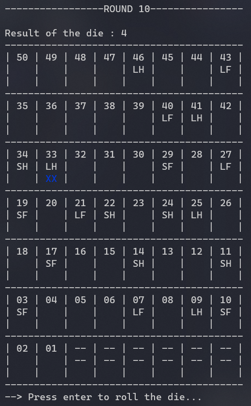

<h1 align="center"> 
  🐍 Snakes and Ladders 🪜
</h1>

Snakes and ladders is a board game. Roll the dice and try your luck! Ladders will take you up but Snakes will take you down! .

# 📃 Table of content

- [📃 Table of content](#-table-of-content)
- [🧑‍💻 Installation](#-installation)
  - [🛠 Installation on Windows](#-installation-on-windows)
  - [🛠 Installation on Linux](#-installation-on-linux)
- [🎮 How to Play](#-how-to-play)
- [🕹️ The gameboard](#️-the-gameboard)
- [✍️ Licence](#️-licence)
- [👨 Creator](#-creator)

# 🧑‍💻 Installation

> Be aware to download the GCC compiler if you want to compile.

## 🛠 Installation on Windows

- Just type this command : `gcc -Wall boardgame.c -o boardgame && boardgame.exe <number_snakes> <number_ladders>`

## 🛠 Installation on Linux

- To start the program, you just need to run the following command `make`
- Then, type this : `./boardgame <number_snakes> <number_ladders>`

# 🎮 How to Play

- Choose the amount of snakes / ladders
- Press enter to roll a die
- And watch your player moving forwards or backwards on the gameboard :)

# 🕹️ The gameboard

<h3 align="center">Screenshot of the gameboard</h3>
<h3 align="center"> </h3> 

- 🔢 **1st : Index of the square**
- **2nd line : If square contains a snake / ladder**
  - 🐍 **SH** : Snake head
  - 🐍 **SF** : Snake foot
  - 🪜 **LH** : Ladder head
  - 🪜 **LF** : Ladder foot
- 📍 **3r line : Location of the player**

# ✍️ Licence

> This project is licensed under the MIT License - see the [LICENSE.md](https://github.com/dylan-power/dinosaur-exploder/blob/main/LICENSE) file for details.

# 👨 Creator

<table align="center">
  <tr>
    <th> <strong>@jvondermarck</strong></th>
  </tr>
</table>
